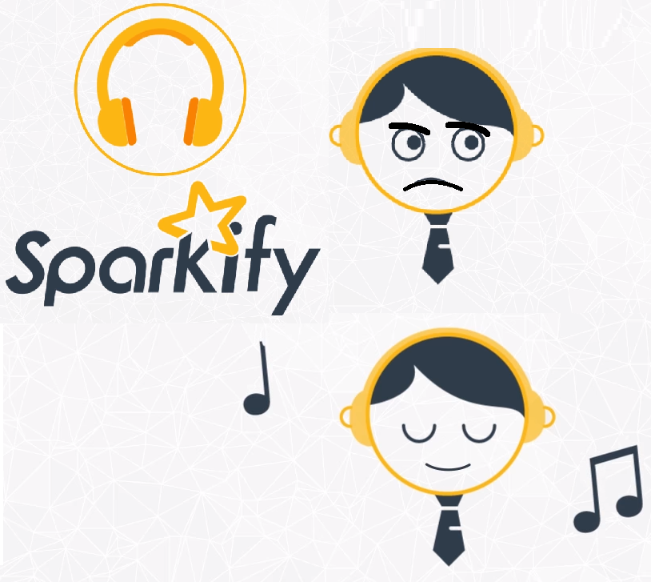

# Sparkify
Churn prediction project for a hypothetical music streaming provider called `Sparkify`. This is capstone project of the `Data Science Nanodegree by Udacity`.

 
 

## Table of Contents
1. [Description](#desc)
2. [Methodology](#meth)
3. [Dataset](#dataset)
4. [Model and performance](#model)
5. [Running the notebook](#notebook)
7. [Author](#author)
8. [License](#license)

# Description

Sparkify is a music streaming service like Spotify. The customers can use either the `Premium`  or the `Free Tier` program. The premium plan with the monthly fees payment enables the use of the service without any advertisements between songs. The aim of the project is to build a Machine Learning model to predict potential customers to churn.

 This enables the company to [secure](https://www.profitwell.com/blog/churn-prediction) valuable customers helping anticipate and prevent from churn trends.

# Methodolody
The used methodolody to train the ML model for customers churn prediction has the following steps

	1. Data Cleaning
	2. Define customer churn indicators
	3. Exploratory Data Analysis
	4. Feature engineering
	5. Model training
	6. Model Evaluation and hyperparameters tuning

The main findings of the project can be found in the `blog post` available [here](https://slitayem.github.io/blog/2020/08/04/sparkify)

# Data Set

The data set contains the users activity logs of the service. Those contain visited pages, service upgrade or downgrade events, events timestamps, ...

### Data schema

	 |-- artist: string (nullable = true)
	 |-- auth: string (nullable = true)
	 |-- firstName: string (nullable = true)
	 |-- gender: string (nullable = true)
	 |-- itemInSession: long (nullable = true)
	 |-- lastName: string (nullable = true)
	 |-- length: double (nullable = true)
	 |-- level: string (nullable = true)
	 |-- location: string (nullable = true)
	 |-- method: string (nullable = true)
	 |-- page: string (nullable = true)
	 |-- registration: long (nullable = true)
	 |-- sessionId: long (nullable = true)
	 |-- song: string (nullable = true)
	 |-- status: long (nullable = true)
	 |-- ts: long (nullable = true)
	 |-- userAgent: string (nullable = true)
	 |-- userId: string (nullable = true)

Currently only a subset of the data was used (286K events).

# Model and performance

In the used subset of the dataset, the churn rate is about `41%`

`Logistic Regression`, `Random Forest` and `Gradient Boosted Trees` classification models were tried out. The perfomance evaluation comparison was performed using `F1-Score` and the `accuracy` metric.

Hyperparameters tuning was also done for all the algorithms to select the most accurate model in predicting potential churning customers.

# Running the notebook

The project code with all the ML process steps can be found in the notebook [here](notebooks/sparkify.ipynb)

You can run the notebook by performing the following steps:
- Create a `Python 3.6` conda virtual environment

    `conda create --name py36 python=3.6`
- Activate the new environment

    `conda activate py36`
- Install required packages by running the following command in the app's directory
    `pip install -r requirements.txt`
- Extract sample data file

    `unzip data/mini_sparkify_event_data.json.zip`
- run `jupyter lab` or `jupyter notebook`

 You can also display the notebook content and its outputs using [nbviewer](https://nbviewer.jupyter.org/github/slitayem/sparkify_dsnd/blob/master/notebooks/sparkify.ipynb). Also an html format of the notebook can be viewed [here](https://nbviewer.jupyter.org/github/slitayem/sparkify_dsnd/blob/master/notebooks/sparkify.html).

## Author

* [slitayem](https://github.com/slitayem)

## License

