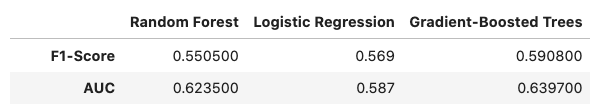

# Sparkify
Churn prediction project for a hypothetical music streaming provider called `Sparkify`. This is capstone project of the `Data Science Nanodegree by Udacity`.

 <center> </center>

## Table of Contents
1. [Description](#desc)
2. [Methodology](#meth)
3. [Data-Set](#dataset)
4. [Project Overview](#prj)
5. [Model and performance](#model)
6. [Running the notebooks](#notebooks)
7. [Author](#author)
8. [License](#license)

<a name="desc"></a>
# Description

This project is done in the context of the Capstone project for `Data Science Nanodegree Program by Udacity`.

The aim here is to build a predictive model for customer attrition for a hypothetical music streaming service called `Sparkify`. Retaining existing customers circumvents the costs of seeking new and potentially risky customers, and allows organizations to focus more accurately on the needs of the existing customers by building relationships.

Sparkify is a music streaming service like Spotify and Pandora. The users can use the service either with the Premium or the Free Tier Plan. The premium plan with the monthly fees payment enables the use of service without any advertisements between songs.
At any point the users can do any of the following:

- Upgrade from the free tier to the Premium subscription
- Downgrade from the Premium subscription to the free tier.
- Drop their account and leave the service

The data analysis, feature engineering and model building was implemented using `PySpark`. The notebooks can be found [here](./notebooks).

<a name="meth"></a>
# Methodolody
The used methodolody to train the ML model consists of the following steps

	1. Data Cleaning
	2. Define customer churn indicators
	3. Exploratory Data Analysis
	4. Feature engineering
	5. Model training
	6. Model Evaluation and hyperparameters tuning

The main findings of the project can be found in the `blog post` available [here](https://slitayem.github.io/blog/2020/08/04/sparkify)

<a name="dataset"></a>
# Data-Set

The used data-set contains the user activity events logs happening in the service. Those contain visited pages, service upgrade or downgrade events, demographic information and events timestamps.

Here are the events key attributes

    |-- artist: artist name
    |-- auth: authentication status
    |-- gender
    |-- itemInSession: Number of items in the session
    |-- length: double (nullable = true)
    |-- level: users subscription level
    |-- page: svisited page
    |-- registration: registration date
    |-- ts: levent timestamp

The presented data analysis was performed on a subset of the data (28.6K events records). The data timespan is 63 days.


<a name="proj"></a>
# Project overview

For the project use case we have a binary classification problem to distinguish between `Churner` and `Engaged` customers.
The following was done to build the model. I started by performing the `data cleaning` to remove log events without a user Id and checked the missing vakues in the dataset. I then did multiple `data explorations` to see how various indicators can help in distinguishing between `Churned` and `Engaged` customers. I defined the customer churn indicator based on wether the user visited the any of the pages `Cancellation Confirmation` and `Downgrade Submission` or not. Next in the features engineering step I extracted categorical and numerical features. For that I used the observed indicators during the data exploration. I also explored the last 20 days of service usage to represent the behaviour of the user before the churn event based on the number of sessions and the number of songs each day.
We split the data into training and validation data sets. And as a final step I performed model training by trying out various models varying from simple to complex ones: Logistic Regression, Random Forest and Gradient-Boosted Trees. I leveraged cross validation and grid search to fine tune the different models. Their `performance` got compared using the `AUC` metric.

Gradient-Boosted Trees turned to be the winning model. We achieved about `0.64` AUC, and `0.59` F1 Score. Potentially with the whole dataset, the data exploration observation and features engineering will be more informative and stable. The model might also be enhanced.



We have to emphasize that the results correspond to models that were trained and tested using a small data-set. The data-set sample contains `286500` events logs for only `225` unique users.

### Potential Improvements

We Could try other models algorithms. But before that we would like to do more substantial data exploration and features engineering to have a more accurate model in detecting whether a user is likely to churn or not with more data examples. For that we would:

- Add more temporal features reflecting the service usage over the last N days.
- Optimize the data analysis and feature engineering steps applying more Spark best practices for having efficient data exploration as well as model training and testing processes.
- Perform data exploration on bigger batches of data subsets before using the big dataset due to the substential statistical differences with the big dataset.
- With a higher computations power, performing a better Hyperparameter tuning for other model algorithms on Spark Cluster.

<a name="notebooks"></a>
# Running the notebooks

The project code with all the ML process steps can be found in the notebooks [here](notebooks)

The different steps of the workflow are implemented in three notebooks

	├── 01_data_cleaning.ipynb: Data cleaning notebook
	├── 02_data_exploration.ipynb: Data exploration notebook
	├── 03_features_eng_and_modeling.ipynb:  Features engineering and models training and evaluation notebook
	└── utils.py : helper functions module

For each of the notebooks, there is an HTML format file.

The required libraries are in the file [requirements.txt](./requirements.txt)

```
pyspark==3.0.0
numpy==1.19.1
pandas==1.1.0
matplotlib==3.3.0
seaborn==0.10.1
```


To run the notebooks you need to perform the following steps:

- Create a `Python 3.6` conda virtual environment

    `conda create --name py36 python=3.6`
- Activate the new environment

    `conda activate py36`
- Install required packages by running the following command in the app's directory
    `pip install -r requirements.txt`
- Extract sample data file

    `unzip data/mini_sparkify_event_data.json.zip`
- run `jupyter lab` or `jupyter notebook`


 You can also display the notebook content and its outputs using [nbviewer](https://nbviewer.jupyter.org). Also an html format of the notebook can be viewed [here](https://nbviewer.jupyter.org/).

## Author

* [slitayem](https://github.com/slitayem)

<a name="license"></a>

## License
[](https://choosealicense.com/licenses/mit/)
